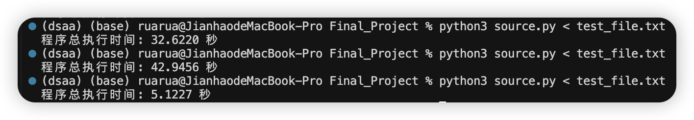

# Product Management System

## Overview
This system implements a product management system using AVL tree as the core data structure. It supports various operations including lookup, insert, delete, range queries with price filtering, and range queries with pattern matching.

## Requirements
- Python 3.6 or higher
- No external dependencies required

## Project Structure


```
.
├── source.py          
├── output.txt        
├── images/           
│   └── structure.svg 
└── README.md         
```

## Code Structure
1. **Core Data Structures**
   - `AVLNode`: Node class for AVL tree
   - `AVLTree`: AVL tree implementation
   - `ProductSystem`: Main system class

2. **String Matching Algorithms**
   - KMP Algorithm
   - Boyer-Moore Algorithm
   - Python built-in 'in' operator

3. **Main Operations**
   - Single-ID Lookup
   - Insert
   - Delete
   - Range Query + Price Filtering
   - Range Query + Pattern Matching

## How to Run
1. **Basic Execution**
```bash
python source.py
```

2. **Input Format**
   - First line: `N Q` (N: number of initial products, Q: number of operations)
   - Next N lines: Initial product records
     ```
     <ProductID> <Price> "Description"
     ```
   - Next Q lines: Operations
     ```
     LOOKUP <ProductID>
     INSERT <ProductID> <Price> "Description"
     DELETE <ProductID>
     RANGE_PRICE <ID1> <ID2> <Tau>
     RANGE_PATTERN <ID1> <ID2> "Pattern"
     ```

3.**Input File**
```bash
python source.py < test_file.txt
```

## Configuration

### 1. String Matching Algorithm Selection
To change the string matching algorithm, modify the `STRING_MATCH_ALGORITHM` constant at the beginning of `source.py`:
```python
STRING_MATCH_ALGORITHM = "IN"  # Options: "KMP", "BM", or "IN"
```
- `"KMP"`: Knuth-Morris-Pratt algorithm
- `"BM"`: Boyer-Moore algorithm
- `"IN"`: Python built-in 'in' operator (default)

### 2. Output File Path
To change the output file path, modify the `OUTPUT_FILE` constant at the beginning of `source.py`:
```python
OUTPUT_FILE = "output.txt"  # Change to your desired path
```

### 3. Execution Time Measurement
The system automatically measures and outputs the total execution time. The timing is implemented in the main block:
```python
if __name__ == "__main__":
    start_time = time.time()
    # ... system execution ...
    end_time = time.time()
    execution_time = end_time - start_time
    print(f"Total execution time: {execution_time:.4f} seconds")
```
Below is the time execution using different string matching methods. 
- The first method is using the **BM** method
- The second method is using the **KMP** method
- The thrid result is using built-in function **"in"**




## Output Format
1. **LOOKUP**: Outputs the price of the product or "Product ID not found"
2. **RANGE_PRICE**: Outputs space-separated product IDs or "No products found"
3. **RANGE_PATTERN**: Outputs space-separated product IDs or "No products found"
4. **INSERT/DELETE**: No output to file
5. **Execution Time**: Printed to terminal

## Example Usage
```
Input:
4 6
10001 19.99 "Apple Watch"
10002 49.50 "Samsung Galaxy Watch"
10003 999.99 "MacBook Pro"
10004 39.99 "Galaxy Buds Pro"
LOOKUP 10001
INSERT 10005 29.99 "Apple Watch SE"
RANGE_PRICE 10000 10005 50.00
RANGE_PATTERN 10000 10005 "Pro"
DELETE 10003
LOOKUP 10003
```
```
Output (output.txt):
19.99
10001 10002 10004 10005
10003 10004
Product ID not found.
```
```
Terminal:
Total execution time: xxx seconds
```

## Performance Considerations

| Operation | Time Complexity | Space Complexity | Description |
|-----------|----------------|------------------|-------------|
| AVL Tree Operations | O(log n) | O(1) | Basic tree operations (insert, delete, lookup) |
| Range Queries | O(log n + k log k) | O(k) | k is the number of results |
| String Matching | | | |
| - KMP | O(n + m) | O(m) | n: text length, m: pattern length |
| - Boyer-Moore | Average O(n/m) | O(m) | Best case performance |

## Notes
- All product IDs are integers
- Prices are floating-point numbers
- Descriptions and patterns are case-sensitive
- Results are always sorted by product ID 